# Launch-Linux-Virtual-Machine

Hello and welcome! In this project we'll launch a Linux Virtual Machine with Amazon Lightsail. Firstly, we'll create an Amazon Linux instance in Amazon Lightsail. After the instance is up and running, we'll connect to it via SSH within the Lightsail console using the browser-based SSH terminal.

[Lightsail](https://aws.amazon.com/lightsail/?p=gsrc&c=ho_lvm) is a Virtual Private Server (VPS) provider. Lightsail provides developers compute, storage, and networking capacity and capabilities to deploy and manage websites and web applications in the cloud. Lightsail includes everything you need to launch your project quickly – virtual machines, containers, databases, CDN, load balancers, DNS management etc. – for a low, predictable monthly price. It's a simple way to get started with AWS for developers, small businesses, students, and other users who need a solution to build and host their applications on cloud.

## Step One: Getting Started

Prior to beginning, you'll need to login to your AWS account. If you do not already have an AWS account set up, please create a free one [here](https://portal.aws.amazon.com/gp/aws/developer/registration/index.html).

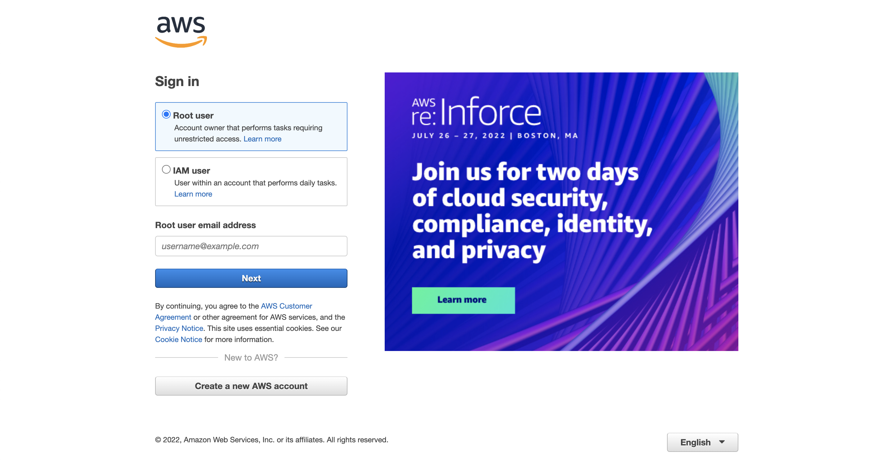

## Step Two: Creating an Amazon Linux instance in Lightsail

1. Navigate to the search bar and type in `Lightsail`. Select the Lightsail service that appears.

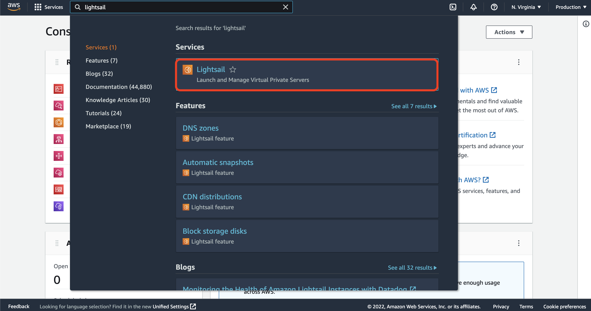

When prompted, select `Let's get started` to begin.

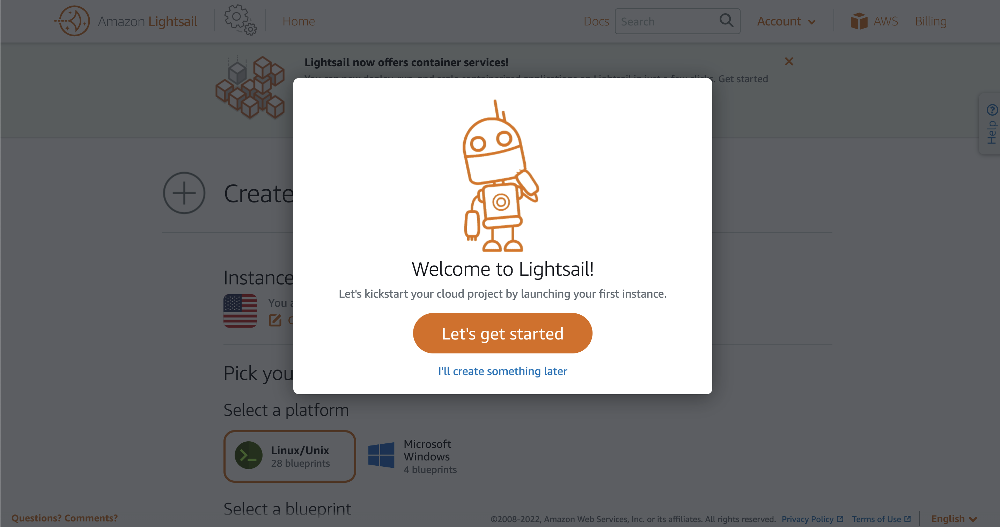

Choose **Create instance** in the **Instances** tab of the Lightsail home page.

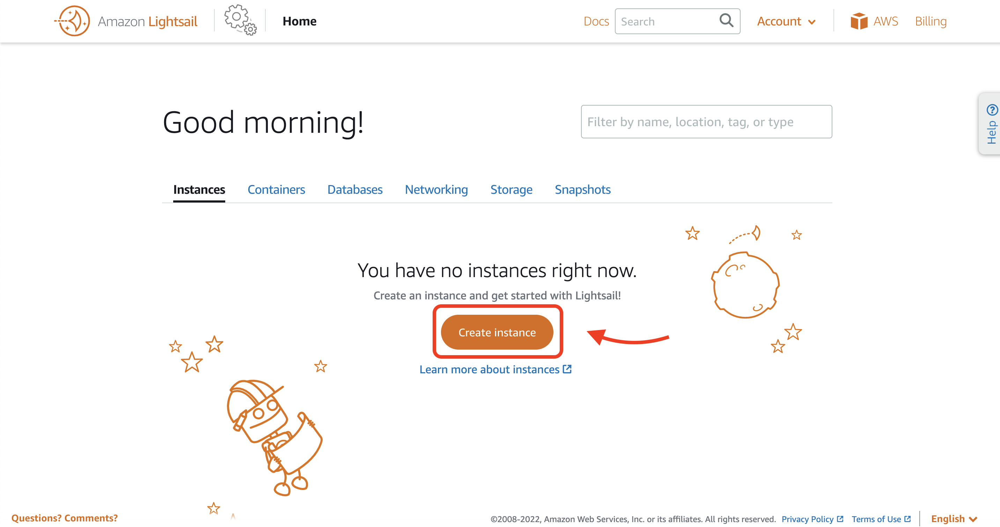

## Step Three: Configuring Amazon Lightsail instance

By default, an instance location may have already been selected for you. You may update it as needed if this is not your preferred location.

1. Under `Pick your instance image`, select the **Linux/Unix** platform option, and choose **OS Only** to view the operating system-only instance images available in Lightsail.

2. Choose **Amazon Linux** as the blueprint option.

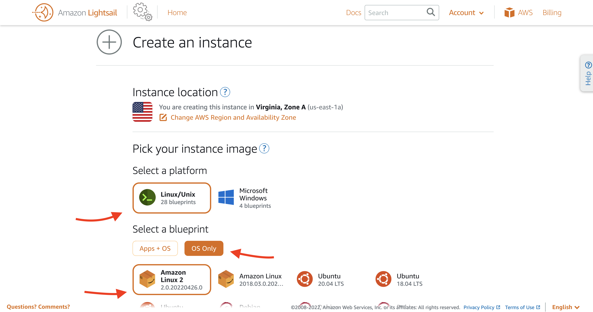

3. Choosing to **Add launch script**, **Change SSH key pair**, or **Enable Automatic Snapshots** is optional. For this project, we'll continue with the defaults.

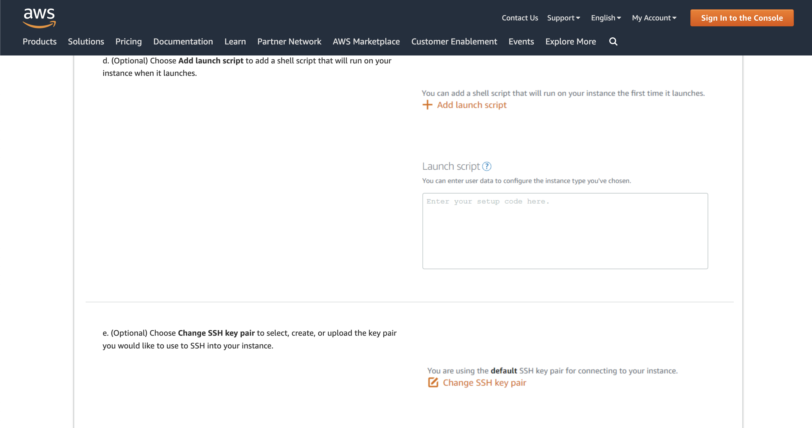

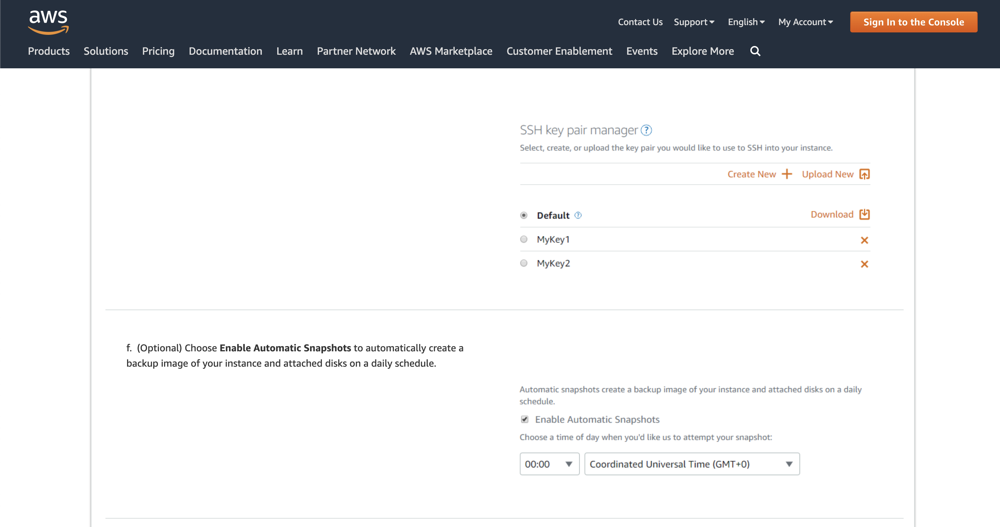

4. Now let's pick an instance plan! You can try the $3.50 USD Lightsail plan free for a limited time (new Lightsail customers), for free for three months.

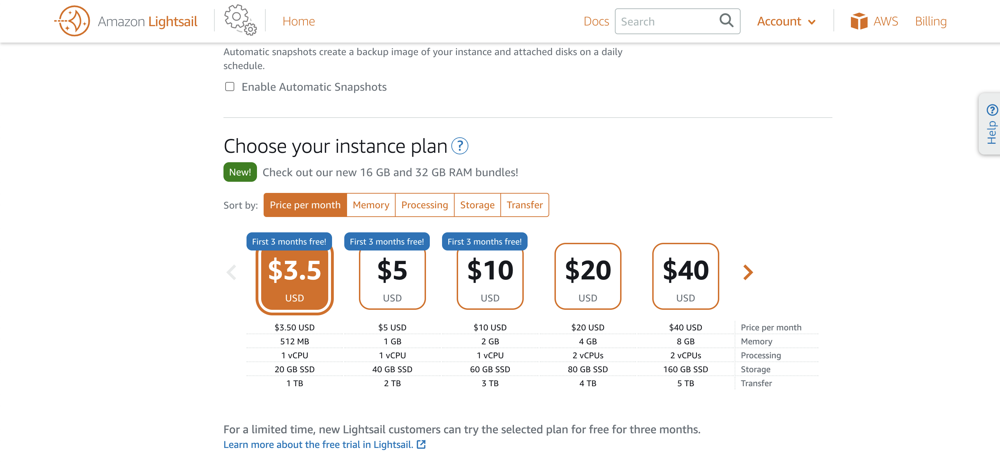

5. Create a unique name for your instance, then select `Create instance` at the bottom of the page. 

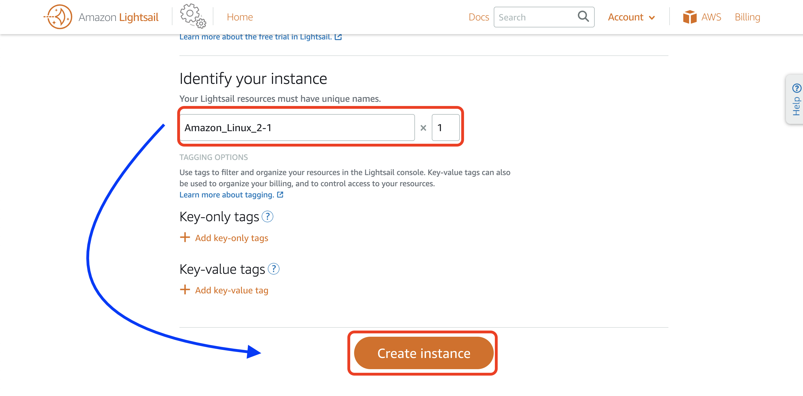

Within minutes, your Amazon Linux instance will be ready, and you can connect to it using the browser-based SSH terminal in the Lightsail console.

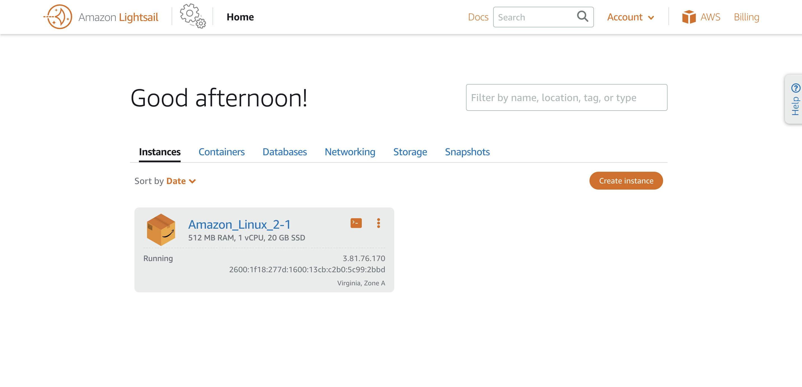

## Step Four: Connecting your instance

You'll need to connect your instance using the browser-based SSH terminal in Lightsail. In the **Instances** tab of the Lightsail home page, choose the terminal icon, or the ellipsis (⋮) icon next to the Amazon Linux instance you just created.

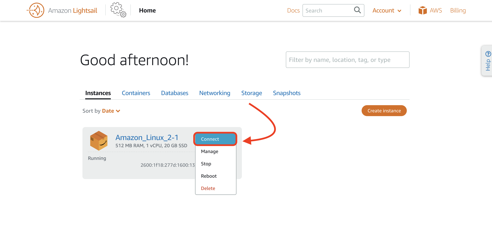

A browser-based SSH terminal window will appear. You can type Linux commands into the browser terminal, and manage your instance without configuring an SSH client!

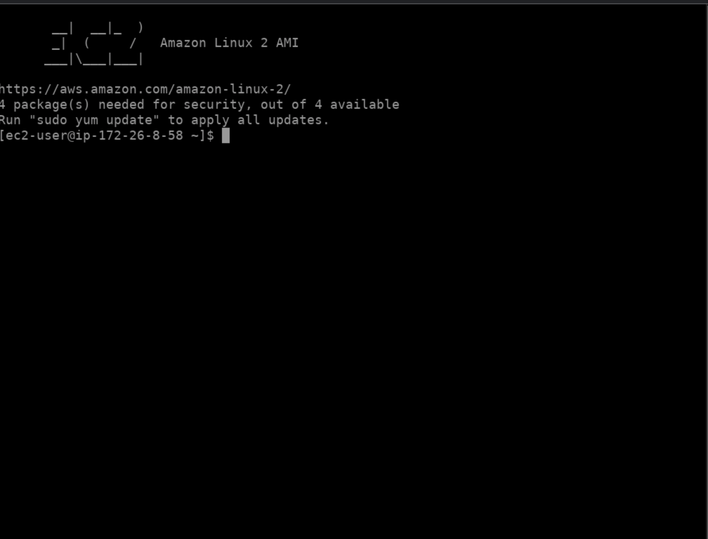

We've successfully used Amazon Lightsail to easily spin up and configure a Linux instance. It's that simple!

## Next Steps

Now that you can connect to your instance, what you do next depends on how you plan to use it. For some ideas, make sure you check out our [resource center](https://aws.amazon.com/lightsail/resources/). Some common next steps include:

- [Create a static IP address](https://lightsail.aws.amazon.com/ls/docs/en_us/articles/lightsail-create-static-ip) for your instance to keep the same IP address each time you stop and start your Lightsail instance.

- [Create a snapshot of your instance](https://lightsail.aws.amazon.com/ls/docs/en_us/articles/lightsail-how-to-create-a-snapshot-of-your-instance) to keep as a backup.

- [Attach a disk to your instance](https://lightsail.aws.amazon.com/ls/docs/en_us/articles/create-and-attach-additional-block-storage-disks-linux-unix) to add more storage space.

Amazon Lightsail is great for developers, WebPros, and anyone looking to get started on AWS in a quick and cheap way. You can launch instances, databases, SSD-based storage, transfer data, monitor your resources, and so much more in a managed way!